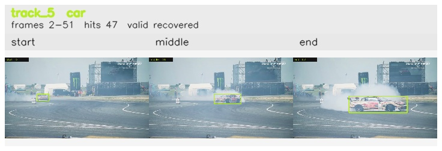

# Object Permanence

An offline two-stage pipeline for identity-preserving object tracking using YOLOv8. The system builds multi-layer YOLO identity embeddings for frame-to-frame linking and uses DINO CLS vectors as relink-only sidecar evidence to verify identity across occlusion gaps.

---

## Overview

Most object detectors treat each frame independently. This pipeline adds a temporal identity layer on top of YOLOv8: every detection is assigned a stable identity that persists across frames, survives occlusion, and can be relinked after a track is lost.

The pipeline runs in two offline stages:

**Stage 1 — Trace Enrichment** (`src/run_pipeline.py`): Samples frames from video, runs YOLOv8, extracts multi-layer feature embeddings per detection, and projects all embeddings to a 128-D target space via PCA. Effective output dimension may be lower when sample count is small.

**Stage 2 — Temporal Linking** (`src/run_temporal_linking.py`): Links detections across sampled frames using cosine similarity on normalized embeddings. Enforces one-to-one assignment via the Hungarian algorithm, then runs a relink pass to recover fragmented tracks after occlusions.

---

## Methodology

### YOLO Embedding Layers

Frame-to-frame linking uses a composite embedding drawn from three YOLO layers, selected via a Fisher-style separability sweep.

| Layer | Tier | Raw Dim | Sweep Separability | Weight |
|---|---|---|---|---|
| 4.cv1 | Appearance | 64 | 15.495 | 0.549 |
| 15 | Semantic | 64 | 9.926 | 0.351 |
| 22.cv3.0 | Class-level | 80 | 13.902 | 0.100 |

**Why these tiers?**

- **Appearance (4.cv1):** Early backbone activations encode texture and color — a strong signal for distinguishing visually distinct objects.
- **Semantic (15):** Mid-network neck activations encode spatial context and object structure, which stays stable across viewpoint changes and partial occlusion.
- **Class-level (22.cv3.0):** Detection-head activations encode class probability space. Retained as a class-consistency gate but weighted conservatively, since same-class instances are often near-identical in this space.

**Methodological caveat:** The calibration sweep used class fallback (`track_id_coverage = 0.0`) rather than stable instance IDs, so these weights reflect class separation more than true same-instance re-identification. They are strong implementation guidance rather than a fully instance-calibrated result.

### Frame-to-Frame Linking

Matching operates on cosine similarity between normalized projected embeddings:

- **Similarity gate:** `visual_similarity >= similarity_threshold` (recommended 0.70)
- **Spatial gate:** centroid distance <= `max_centroid_distance` (default 0.40, normalized by frame diagonal)
- **Class mismatch:** not a hard reject — cross-class matches receive a soft penalty (`class_mismatch_penalty`, default 0.20) when `match_within_class=true`
- **Assignment:** Hungarian algorithm for globally consistent one-to-one matching per frame pair

**Track state machine:** `TENTATIVE → ACTIVE → LOST → CLOSED`. New detections start as TENTATIVE, become ACTIVE once they accumulate enough support, move to LOST when temporarily unmatched, and become CLOSED when no longer eligible for extension. Reference descriptors blend last, EMA, and history vectors to resist appearance drift. Track class is resolved via a confidence-weighted vote across all linked observations, not from the most recent detector label.

### DINO Gallery Relink

DINO is used only at relink time, where discriminability matters more than frame-to-frame stability. It is never part of the primary tracking embedding.

**Relink process:**

1. Extract DINO per detection during enrichment and store as sidecar metadata.
2. Retain valid DINO observations on each track and build a representative gallery per closed fragment at relink time.
3. Score DINO relink candidates by the mean of the strongest gallery-to-gallery cosine matches (top-k mean), rather than a single fragment mean vector.
4. Fall back to YOLO relink scoring when DINO is unavailable or disabled, then spatial plausibility as a third pass.

**Gallery construction:** Each closed fragment keeps a temporally ordered set of valid DINO samples. At relink time, these are reduced to a fixed-size representative gallery (`relink_dino_gallery_size`, default 20) by dividing the fragment lifetime into temporal buckets and keeping the highest-confidence sample from each. Fragment similarity is computed from the pairwise cosine matrix between galleries, reduced with a top-k mean (`relink_dino_gallery_topk`, default 3). This favors fragments that agree on several strong appearance matches and reduces false merges from noisy individual frames.

### Class Resolution Under Label Noise

YOLO class labels are treated as noisy metadata, not a hard identity gate:

- Frame-to-frame matching applies `class_mismatch_penalty` instead of rejecting mismatches outright.
- Relink applies a smaller `relink_class_mismatch_penalty` (default 0.10) for the same reason: a fragment labeled *vase* can still be a valid continuation of a *sports ball* track if appearance and motion evidence are strong enough.
- Each track resolves its `class_id` / `class_name` from a confidence-weighted vote across all observations. Raw per-detection labels and confidence scores are preserved in `tracks.json` and trace summaries for inspection.

**Relink scoring by method:**
- **dino:** top-k mean cosine over fragment galleries, when both fragments have sufficient valid DINO samples and `relink_use_dino=true` (gate: `relink_dino_threshold`)
- **yolo:** cosine on YOLO fragment centroids when DINO is unavailable or disabled (gate: `relink_threshold`)
- **spatial:** spatial plausibility fallback for unresolved pairs (gate: `relink_fallback_threshold`)

Temporal ordering is enforced; cross-class fragment pairs are allowed but penalized. Accepted chains are merged into canonical track IDs. DINO contribution metrics are recorded in `relink_manifest.json`: `relink_dino_coverage`, `relink_dino_accepted`, `relink_yolo_accepted`.

---

## Known Limitations

The main failure modes are detector-driven rather than linker-driven:

- **Layer calibration is class-level, not instance-level.** The separability sweep used class fallback rather than stable instance IDs, so the selected weights separate categories more reliably than visually similar instances of the same class.
- **Spurious detections remain trackable.** If YOLO emits a persistent false positive, the tracker can keep it internally consistent.
- **Heavy occlusion is only partially recoverable.** Gallery relink recovers many splits, but cannot resolve cases where an occluder itself creates a competing detection.

The broader pattern across both ball and DAVIS sequences is the same: **the linker is often stronger than the detector**. Stable boxes and long relinked tracks are necessary but not sufficient — they do not guarantee correct semantic labels.

---

## Experiment Results

### Configuration

All end-to-end results use the following (R4) configuration: embedding layers 4.cv1 + 15 + 22.cv3.0 with weights 0.549 / 0.351 / 0.100; raw YOLO dim 208; PCA target 128 (effective dim may be lower on small runs); DINO sidecar dim 384; `activation_topk=64`; `similarity_threshold=0.70`; `max_centroid_distance=0.40`; `relink_use_dino=true`; `relink_dino_threshold=0.55`; `relink_threshold=0.55`; `relink_max_gap_frames=-1`; `relink_fallback_threshold=0.40`.

### Ball Tracking Scenarios

| Scenario | Frames | Detections | Ball Tracks | Total Tracks | Valid Tracks | Relink Edges |
|---|---|---|---|---|---|---|
| 10sec_Left_to_Right | 133 | 160 | 1 | 6 | 5 | 1 |
| 3sec_Left_to_Right | 49 | 77 | 1 | 6 | 5 | 1 |
| Exit_frame_while_occluded | 53 | 72 | 1 | 5 | 4 | 0 |
| Left_bounce_back | 64 | 105 | 1 | 5 | 4 | 2 |
| Left_to_right | 25 | 52 | 1 | 6 | 5 | 1 |
| No_occlusion_ball_removed | 34 | 37 | 1 | 9 | 4 | 1 |
| Occlusion_ball_removed | 48 | 114 | 1 | 14 | 8 | 2 |
| Right_to_left | 21 | 40 | 1 | 4 | 3 | 1 |
| **Totals** | **427** | **657** | **8** | **55** | **38** | **9** |

`activation_topk=64` is the default operating point. On Right_to_left, k=12 and k=64 produced identical results, so the larger value was retained for stability.

### DINO Relink Threshold Sweep

All runs share the configuration above, varying only `relink_use_dino` and `relink_dino_threshold`. R0 is the DINO-disabled baseline.

| Run | relink_use_dino | relink_dino_threshold | Total Tracks | Valid Tracks | Relink Edges | relink_dino_coverage |
|---|---|---|---|---|---|---|
| R0 | false | — | 56 | 39 | 8 | 0.000 |
| R1 | true | 0.40 | 55 | 38 | 9 | 1.000 |
| R2 | true | 0.45 | 55 | 38 | 9 | 1.000 |
| R3 | true | 0.50 | 55 | 38 | 9 | 1.000 |
| R4 | true | 0.55 | 55 | 38 | 9 | 1.000 |
| R5 | true | 0.60 | 56 | 39 | 8 | 1.000 |
| R6 | true | 0.65 | 56 | 39 | 8 | 1.000 |

Winner under constraint (total_tracks <= R0): R1. R1 through R4 tie on aggregate metrics.

### Ball Tracking: Qualitative Examples

**Successful recovery — long left-to-right track**

`10sec_Left_to_Right track 1` shows the sports ball surviving fragmentation and being merged back into a single canonical trajectory across the full clip.


**Successful recovery — bounce-back relink**

`Left_bounce_back track 1` shows the ball leaving the neighborhood of its prior detections, fragmenting, and being correctly recovered into the same final track.


**Limitation — spurious non-ball track survives relink**

`Occlusion_ball_removed track 5` shows a detector-driven false positive. The linker keeps the track internally consistent but cannot correct the fact that YOLO emitted a persistent non-ball detection.


**Limitation — stable false positive without heavy occlusion**

`No_occlusion_ball_removed track 8` shows that consistent false detections can form coherent tracks and survive relink even in simple scenes.


### Scenario Summary

| Domain | Example | Track Continuity | Semantic Label | What It Shows |
|---|---|---|---|---|
| Ball rolling | 10sec_Left_to_Right track 1 | Pass | Pass | Canonical sports-ball identity preserved across fragmentation and relink |
| Vehicle motion | drift-chicane track 5 | Pass | Fail at clip level | Main race car stays boxed; off-class vehicle fragments appear elsewhere in scene |
| Ball removal | Occlusion_ball_removed track 5 | Pass | Fail | Stable false-positive track survives relink despite wrong semantics |
| Vehicle street scene | scooter-black track 1 | Pass | Fail | One rider+scooter entity splits into parallel car, motorcycle, and person identities |

---

## DAVIS Stress Benchmark

To stress the tracker on real-world motion and occlusion, the repo includes a curated DAVIS stress subset built via `scripts/build_davis_curated_dataset.py --preset stress`. All results below use the dense run (`SAMPLE_RATE=1`).

```bash
SAMPLE_RATE=1 VIDEO_GLOB='data/raw_videos/davis__*.mp4' bash scripts/run_full_pipeline.sh
python3 scripts/summarize_davis_curated_results.py
```

Results are written to `experiments/results/davis_curated_summary.csv` and `.json`.

**Pass/fail criteria:**
- **Class Eval:** PASS when >= 85% of detections fall into the scenario's expected class set
- **Track Eval:** PASS when the strongest expected-class track covers >= 50% of sampled frames
- **Overall:** PASS only when both pass

These are practical reporting heuristics, not ground-truth mAP or ReID metrics.

| DAVIS Sequence | Expected-Class Share | Best Expected Track | Class Eval | Track Eval | Overall | Notes |
|---|---|---|---|---|---|---|
| parkour | 86.2% | 96 / 100 | PASS | PASS | PASS | Strong person continuity; small skateboard / suitcase fragments remain |
| bmx-bumps | 86.1% | 49 / 90 | PASS | PASS | PASS | Person and bicycle dominate; occasional clutter labels (bench, car, backpack) |
| breakdance | 95.1% | 84 / 84 | PASS | PASS | PASS | High class purity, but longest-lived person tracks often belong to spectators, not the acrobat |
| dance-twirl | 98.2% | 75 / 90 | PASS | PASS | PASS | Primary dancer stays on-class even in a cluttered crowd scene |
| horsejump-high | 69.7% | 50 / 50 | FAIL | PASS | FAIL | Rider track is stable; scene clutter creates potted plant, stop sign, and car fragments |
| bear | 93.2% | 49 / 82 | PASS | PASS | PASS | Stable bear track with only a small vase spillover |
| drift-chicane | 32.3% | 47 / 52 | FAIL | PASS | FAIL | Car motion is stable; detector labels drift into person, truck, boat, and airplane |
| scooter-black | 81.0% | 43 / 43 | FAIL | PASS | FAIL | Same rider+scooter entity splits into motorcycle, person, and car tracks |
| motocross-jump | 95.0% | 39 / 40 | PASS | PASS | PASS | Rider and motorcycle labels remain clean overall |

### DAVIS Qualitative Examples

**Strength — long person track through occlusion**

`parkour track 1` is the clearest example of the detector and linker working together: the dominant person remains correctly labeled and the final track spans nearly the entire sequence.


**Strength — race car localized through smoke and motion blur**

`drift-chicane track 5` is the clean vehicle-tracking case. The main race car stays boxed across smoke, scale change, and rapid motion, despite the same clip accumulating off-class fragments elsewhere.



**Limitation — stable track, wrong class**

`drift-chicane track 2` mirrors the ball false-positive cases: the box is spatially consistent, but the semantic label is wrong. The pipeline relinks the fragment; it cannot correct a detector-driven *truck* label on a race car.


**Limitation — one physical object, multiple class identities**

`scooter-black` shows a harder failure mode than simple false positives: the same rider+scooter entity is broken into parallel motorcycle, person, and car tracks. Temporal consistency alone is not enough to resolve conflicting class identity.


**Note on breakdance:** This clip passes the heuristic table because most detections are correctly labeled *person* and several long person tracks exist. The qualitative issue is that the highest-hit tracks often belong to spectators at the frame edge while the acrobat appears in lower-hit tracks (e.g., track_10). It is a useful stress clip for detector behavior but a poor showcase for primary-subject tracking.

---

## Reproduction

```bash
python3 -m venv .venv
source .venv/bin/activate
python3 -m pip install -r requirements.txt
```

**Minimal reproduction:**

```bash
bash scripts/run_full_pipeline.sh
```

For each input video, writes enriched detections to `experiments/results/activation_enrichment/<scenario>/` and linked outputs to `experiments/results/linking/<scenario>/`, including `tracks.json`, `relink_manifest.json`, `trace_summary.json`, and rendered `trace_summary/` images.

**DAVIS stress subset:**

```bash
python3 scripts/build_davis_curated_dataset.py --preset stress
SAMPLE_RATE=1 VIDEO_GLOB='data/raw_videos/davis__*.mp4' bash scripts/run_full_pipeline.sh
python3 scripts/summarize_davis_curated_results.py
```
