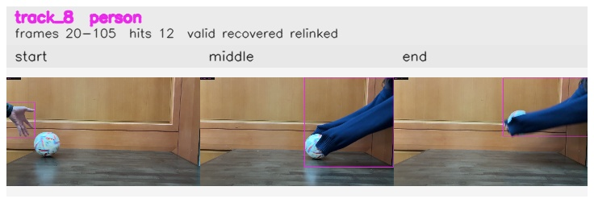
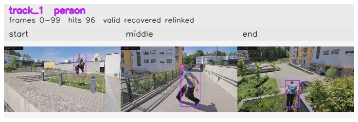
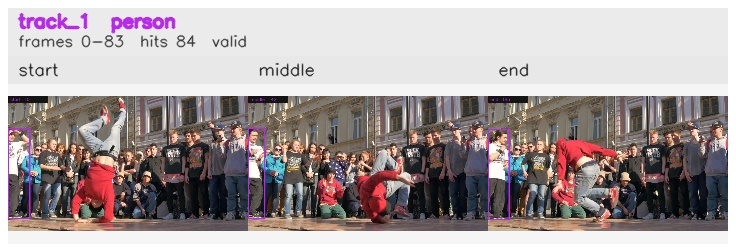
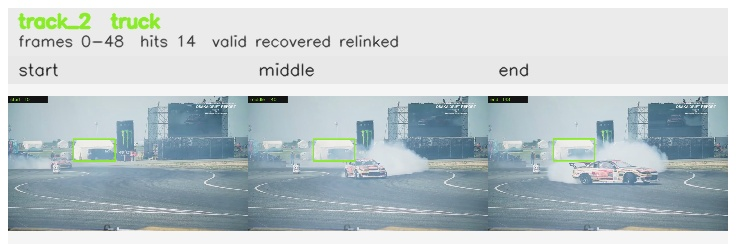
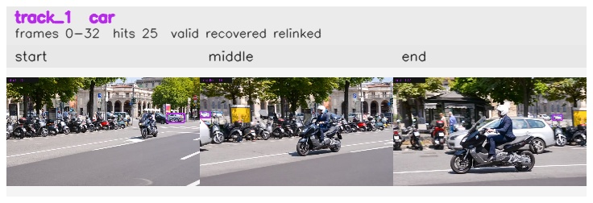

## Object Permanence

An offline two-stage pipeline for identity-preserving object tracking using YOLOv8. The system builds multi-layer YOLO identity embeddings for frame-to-frame linking and uses DINO CLS vectors as relink-only sidecar evidence to verify identity across occlusion gaps.

---

## Overview

Most object detectors treat each frame independently. This pipeline adds a temporal identity layer on top of YOLOv8: every detection is assigned a stable identity that persists across frames, survives occlusion, and can be relinked after a track is lost.

The pipeline runs in two offline stages:

**Stage 1 - Trace Enrichment** (`src/run_pipeline.py`)
Samples frames from video, runs YOLOv8, extracts multi-layer feature embeddings per detection, and projects all embeddings to a 128-D target embedding via PCA (actual per-run output dim can be lower when sample count is small).

**Stage 2 - Temporal Linking** (`src/run_temporal_linking.py`)
Links detections across sampled frames using cosine similarity on normalized embeddings. Enforces one-to-one assignment via the Hungarian algorithm and runs a relink pass to recover fragmented tracks after occlusions.

---

## Known Limitations

The main failure modes are detector-driven rather than linker-driven:
- **Layer calibration is still class-level, not instance-level.** The current sweep used class fallback (`track_id_coverage = 0.0`) rather than stable instance IDs, so the selected weights separate categories more reliably than visually similar instances of the same class.
- **Spurious detections remain trackable.** If YOLO emits a persistent false positive, the tracker can keep it internally consistent.
- **Heavy occlusion is only partially recoverable.** Gallery relink recovers many splits, but cannot resolve cases where the occluder itself creates a competing detection.

---

## Methodology

Frame-to-frame linking uses a YOLO-only multi-layer composite embedding. Layer weights come from a separability sweep over candidate YOLO layers.

| Layer | Tier | Raw Dim | Sweep Separability | Weight |
|---|---|---:|---:|---:|
| `4.cv1` | Appearance | 64 | 15.495 | 0.549 |
| `15` | Semantic | 64 | 9.926 | 0.351 |
| `22.cv3.0` | Class-level | 80 | 13.902 | 0.100 |

**Why these YOLO tiers?**
- **Appearance (4.cv1):** Early backbone activations encode texture and color patterns, a strong signal for distinguishing objects that look different.
- **Semantic (15):** Mid-network neck activations encode spatial context and object structure, which stays stable across viewpoint changes and partial occlusion.
- **Class-level (22.cv3.0):** Detection-head activations encode class probability space. It is retained as a class-consistency gate but weighted conservatively because same-class instances are often near-identical in this space.

Layer weights were chosen from a Fisher-style separability sweep over YOLO layers. The current sweep used class fallback rather than stable instance IDs, so these weights should be interpreted as strong implementation guidance rather than a final instance-level optimum.

**Methodological caveat.** Because the calibration sweep did not have stable `track_id` supervision, the separability scores reflect class separation more than true same-instance re-identification. That is acceptable for choosing a practical YOLO embedding stack, but it is not yet a fully instance-calibrated result.

### DINO Gallery Relink

DINO is used only at relink time, where discriminability matters more than frame-to-frame stability:
- Extract DINO per detection during enrichment and store it as sidecar metadata.
- Retain valid DINO observations on each track and build a representative gallery per closed fragment at relink time.
- Score DINO relink candidates by the mean of the strongest gallery-to-gallery cosine matches, rather than a single fragment mean vector.
- Fall back to YOLO relink scoring when DINO is missing, and keep spatial fallback as a third pass.

The gallery reducer is designed to preserve temporal coverage rather than only the highest-confidence frames:
- Each closed fragment keeps a temporally ordered set of valid DINO samples gathered during tracking.
- At relink time, those samples are reduced to a fixed-size representative gallery (`relink_dino_gallery_size`, default `20`) by dividing the fragment lifetime into temporal buckets and keeping the highest-confidence sample from each bucket.
- Fragment similarity is computed from the pairwise cosine matrix between the two galleries and reduced with a top-k mean (`relink_dino_gallery_topk`, default `3`).
- This favors fragments that agree on several strong appearance matches and reduces the chance that a single noisy frame causes a false merge.

### Class Resolution Under Label Noise

YOLO class labels are treated as **noisy metadata**, not a hard identity gate:
- Frame-to-frame matching applies a configurable cross-class penalty (`class_mismatch_penalty`) instead of rejecting class mismatches outright.
- Relink applies a smaller cross-class penalty (`relink_class_mismatch_penalty`) for the same reason: a fragment labeled `vase` can still be a valid continuation of a `sports ball` track if appearance and motion evidence are strong.
- Each track resolves its displayed `class_id` / `class_name` from a confidence-weighted vote across all of its observations.
- Track observations keep the raw per-detection class label and confidence so mislabeled frames remain inspectable in `tracks.json` and the rendered trace summaries.

### Linking Pipeline

Frame-to-frame linking operates on cosine similarity between normalized projected embeddings.

**Matching**
- Similarity gate: `visual_similarity >= similarity_threshold` (recommended `0.70`).
- Spatial plausibility gate: centroid distance must be <= `max_centroid_distance` (default `0.40`, normalized by frame diagonal) before cosine scoring.
- Class mismatch is not a hard reject. When `match_within_class=true`, cross-class frame matches receive a soft assignment penalty (`class_mismatch_penalty`, default `0.20`).
- Assignment: Hungarian algorithm for globally consistent one-to-one matching per frame pair.

**Track state machine**
```text
TENTATIVE -> ACTIVE -> LOST -> CLOSED
```

New detections start as `TENTATIVE`, become `ACTIVE` once they accumulate enough support, move to `LOST` when temporarily unmatched, and become `CLOSED` when they are no longer eligible for extension and only remain as relink candidates.
Reference descriptors blend last, EMA, and history vectors for stability against appearance drift.
Track class is resolved from the confidence-weighted vote of its linked observations, not from the most recent detector label.

**Relink pass**
After the primary linking run, a second pass evaluates pairs of closed track fragments to recover identities split by occlusion:
- Enforces temporal ordering constraints; cross-class fragment pairs are allowed but penalized.
- Scores identity by method:
  - `dino`: top-k mean cosine over fragment DINO galleries when both fragments have enough valid DINO samples and `relink_use_dino=true` (gate: `relink_dino_threshold`).
  - `yolo`: cosine on YOLO fragment centroids when DINO is unavailable or disabled (gate: `relink_threshold`).
- Applies a relink class mismatch penalty (`relink_class_mismatch_penalty`, default `0.10`) to identity and spatial fallback scores when fragment-level resolved classes disagree.
- Falls back to spatial plausibility (`spatial`) as a third pass for unresolved pairs (gate: `relink_fallback_threshold`).
- Merges accepted chains into canonical track IDs.
- Records DINO contribution metrics in `relink_manifest.json`: `relink_dino_coverage`, `relink_dino_accepted`, `relink_yolo_accepted`.

---

## Experiment Results

`activation_topk=64` is the default operating point. On `Right_to_left`, `k=12` and `k=64` produced the same ball track count and total track count, so the larger value was retained for stability.

### End-to-End Scenario Results

Configuration below reflects the DINO relink-sidecar run (`R4`): embedding layers `4.cv1 + 15 + 22.cv3.0` with weights `0.549/0.351/0.100`, raw YOLO dim `208`, PCA target `128` (effective dim may be lower on small runs), DINO sidecar dim `384`, `activation_topk=64`, `similarity_threshold=0.70`, `max_centroid_distance=0.40`, `relink_use_dino=true`, `relink_dino_threshold=0.55`, `relink_threshold=0.55`, `relink_max_gap_frames=-1`, `relink_fallback_threshold=0.40`.

| Scenario | Frames | Detections | Ball Tracks | Total Tracks | Valid Tracks | Relink Edges |
|---|---:|---:|---:|---:|---:|---:|
| 10sec_Left_to_Right | 133 | 160 | 1 | 6 | 5 | 1 |
| 3sec_Left_to_Right | 49 | 77 | 1 | 6 | 5 | 1 |
| Exit_frame_while_occluded | 53 | 72 | 1 | 5 | 4 | 0 |
| Left_bounce_back | 64 | 105 | 1 | 5 | 4 | 2 |
| Left_to_right | 25 | 52 | 1 | 6 | 5 | 1 |
| No_occlusion_ball_removed | 34 | 37 | 1 | 9 | 4 | 1 |
| Occlusion_ball_removed | 48 | 114 | 1 | 14 | 8 | 2 |
| Right_to_left | 21 | 40 | 1 | 4 | 3 | 1 |
| **Totals** | **427** | **657** | **8** | **55** | **38** | **9** |

### DINO Relink Threshold Sweep (totals)

All runs used the same configuration as above except `relink_use_dino` / `relink_dino_threshold`.

| Run | relink_use_dino | relink_dino_threshold | Total Tracks | Valid Tracks | Relink Edges | relink_dino_coverage |
|---|---:|---:|---:|---:|---:|---:|
| R0 | false | — | 56 | 39 | 8 | 0.000 |
| R1 | true | 0.40 | 55 | 38 | 9 | 1.000 |
| R2 | true | 0.45 | 55 | 38 | 9 | 1.000 |
| R3 | true | 0.50 | 55 | 38 | 9 | 1.000 |
| R4 | true | 0.55 | 55 | 38 | 9 | 1.000 |
| R5 | true | 0.60 | 56 | 39 | 8 | 1.000 |
| R6 | true | 0.65 | 56 | 39 | 8 | 1.000 |

Winner under constraint (`total_tracks <= R0`) is `R1`; `R1` through `R4` tie on aggregate metrics.

### Qualitative Trace Summary Examples

The figures below are tracked copies of representative `trace_summary` outputs and illustrate both successful recoveries and detector-driven failure modes.

**Successful recovery: long left-to-right ball track**

`10sec_Left_to_Right` track `1` shows the sports ball surviving fragmentation and being merged back into a single canonical trajectory.


**Successful recovery: bounce-back relink**

`Left_bounce_back` track `1` is a representative case where the ball leaves the immediate neighborhood of its prior detections, fragments, and is later recovered into the same final track.


**Limitation: spurious non-ball recovery**

`Occlusion_ball_removed` track `5` is a good example of a detector-driven false positive. The temporal linker can keep this track internally consistent, but it cannot correct the fact that YOLO emitted a persistent non-ball object.


**Limitation: stable false-positive track**

`No_occlusion_ball_removed` track `8` shows that even without heavy occlusion, consistent false detections can still form coherent tracks and survive relink.



### DAVIS Stress Benchmark (`SAMPLE_RATE=1`)

To stress the tracker on real-world motion and occlusion, the repo now includes a curated DAVIS stress subset built from frame sequences via `scripts/build_davis_curated_dataset.py --preset stress`. All results below come from the dense run:

```bash
SAMPLE_RATE=1 VIDEO_GLOB='data/raw_videos/davis__*.mp4' bash scripts/run_full_pipeline.sh
python3 scripts/summarize_davis_curated_results.py
```

The benchmark summary is written to `experiments/results/davis_curated_summary.csv` and `experiments/results/davis_curated_summary.json`.

**How to read the pass/fail table**
- `Class Eval` is `PASS` when at least `85%` of detections fall into the scenario's expected class set.
- `Track Eval` is `PASS` when the strongest expected-class track covers at least `50%` of sampled frames.
- `Overall` is `PASS` only when both of the above pass.
- These are practical heuristics for README reporting, not ground-truth mAP or ReID metrics.

| DAVIS Sequence | Expected-Class Share | Best Expected Track | Class Eval | Track Eval | Overall | Notes |
|---|---:|---:|---|---|---|---|
| `parkour` | `86.2%` | `96 / 100` | `PASS` | `PASS` | `PASS` | Strong person continuity; small `skateboard` / `suitcase` fragments remain. |
| `bmx-bumps` | `86.1%` | `49 / 90` | `PASS` | `PASS` | `PASS` | Person and bicycle dominate, with occasional clutter labels (`bench`, `car`, `backpack`). |
| `breakdance` | `95.1%` | `84 / 84` | `PASS` | `PASS` | `PASS` | Person labeling stays strong despite extreme pose and motion changes. |
| `dance-twirl` | `98.2%` | `75 / 90` | `PASS` | `PASS` | `PASS` | The primary dancer stays on-class even in a cluttered crowd scene. |
| `horsejump-high` | `69.7%` | `50 / 50` | `FAIL` | `PASS` | `FAIL` | Rider track is stable, but scene clutter creates `potted plant`, `stop sign`, and `car` fragments. |
| `bear` | `93.2%` | `49 / 82` | `PASS` | `PASS` | `PASS` | Stable bear track with only a small `vase` spillover. |
| `drift-chicane` | `32.3%` | `47 / 52` | `FAIL` | `PASS` | `FAIL` | Car motion is stable, but detector labels drift into `person`, `truck`, `boat`, and `airplane`. |
| `scooter-black` | `81.0%` | `43 / 43` | `FAIL` | `PASS` | `FAIL` | Same rider+scooter entity splits into `motorcycle`, `person`, and `car` tracks. |
| `motocross-jump` | `95.0%` | `39 / 40` | `PASS` | `PASS` | `PASS` | Rider and motorcycle labels remain clean overall. |

**DAVIS strength: long person track through occlusion**

`parkour` track `1` is the best example of the detector and linker working together on a real-world occlusion clip: the dominant person remains correctly labeled and the final track spans nearly the entire sequence.



**DAVIS strength: fast motion with strong class stability**

`breakdance` track `1` shows that the model can keep the primary performer on-class even under rapid pose changes, crowd background clutter, and large appearance shifts.



**DAVIS limitation: stable track, wrong class**

`drift-chicane` track `2` is analogous to the README's earlier non-ball failure cases: the box is spatially consistent, but the semantic label is wrong. The pipeline can relink the fragment; it cannot correct a detector-driven `truck` label on a race car.



**DAVIS limitation: one physical object, multiple class identities**

`scooter-black` shows a harder semantic failure mode than simple false positives. The same rider+scooter entity is broken into parallel `motorcycle`, `person`, and `car` tracks, so temporal consistency alone is not enough to resolve the class identity.



These DAVIS examples reinforce the same lesson as the ball examples above: the linker is often stronger than the detector. Stable boxes and long relinked tracks are necessary, but they do not guarantee that the semantic class is correct.

---

## Reproduction

```bash
python3 -m venv .venv
source .venv/bin/activate
python3 -m pip install -r requirements.txt
```

**Minimal reproduction**
```bash
bash scripts/run_full_pipeline.sh
```

For each input video, the script writes enriched detections to `experiments/results/activation_enrichment/<scenario>/` and linked outputs to `experiments/results/linking/<scenario>/`, including `tracks.json`, `relink_manifest.json`, `trace_summary.json`, and rendered `trace_summary/` images.

**DAVIS stress subset**
```bash
python3 scripts/build_davis_curated_dataset.py --preset stress
SAMPLE_RATE=1 VIDEO_GLOB='data/raw_videos/davis__*.mp4' bash scripts/run_full_pipeline.sh
python3 scripts/summarize_davis_curated_results.py
```
