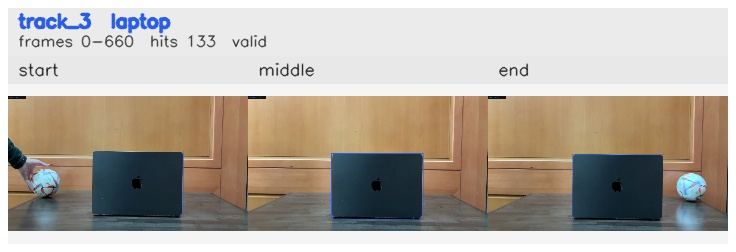

# 10sec_Left_to_Right / track_3

## Summary
- class: laptop (63)
- frames: 0-660 (661 frame span)
- hits: 133
- valid track: yes
- had recovery: no
- relinked from: none
- fragment track ids: 3
- avg visual similarity: 0.9943
- total misses: 0
- max miss streak: 0

## Label Mix
- laptop (63): 133 detections, confidence sum 83.005

## Relink Edges
- none

## Event Timeline
- frame 0: created
- frame 5: activated
- frame 660: closed

## Key Frames
- start: frame 0, fragment 3, [image](frames/start_f0000.jpg)
- middle: frame 330, fragment 3, [image](frames/middle_f0330.jpg)
- end: frame 660, fragment 3, [image](frames/end_f0660.jpg)

[track metadata](track.json)
