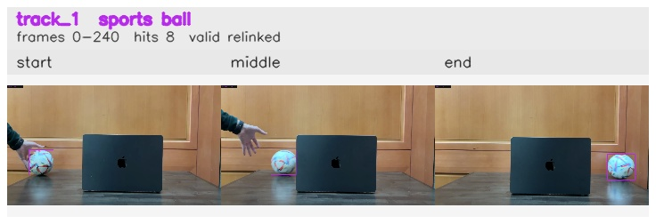

# 3sec_Left_to_Right / track_1

## Summary
- class: sports ball (32)
- frames: 0-240 (241 frame span)
- hits: 8
- valid track: yes
- had recovery: no
- relinked from: 7
- fragment track ids: 1, 7
- avg visual similarity: 0.9666
- total misses: 7
- max miss streak: 7

## Label Mix
- sports ball (32): 6 detections, confidence sum 5.174
- vase (75): 2 detections, confidence sum 0.662

## Relink Edges
- 1 -> 7 via dino (score 0.7779)

## Event Timeline
- frame 0: created
- frame 5: activated
- frame 25: closed
- frame 30: lost
- frame 235: created
- frame 240: activated
- frame 240: closed

## Key Frames
- start: frame 0, fragment 1, [image](frames/start_f0000.jpg)
- middle: frame 20, fragment 1, [image](frames/middle_f0020.jpg)
- end: frame 240, fragment 7, [image](frames/end_f0240.jpg)

[track metadata](track.json)
