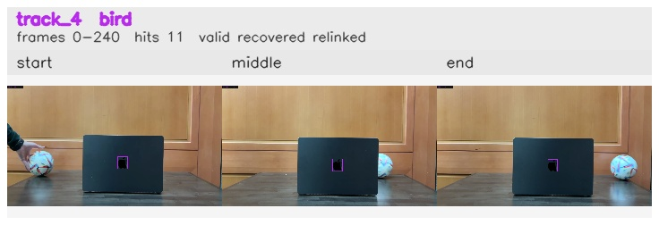

# 3sec_Left_to_Right / track_4

## Summary
- class: bird (14)
- frames: 0-240 (241 frame span)
- hits: 11
- valid track: yes
- had recovery: yes
- relinked from: 6
- fragment track ids: 4, 6
- avg visual similarity: 0.9896
- total misses: 8
- max miss streak: 7

## Label Mix
- bird (14): 11 detections, confidence sum 3.737

## Relink Edges
- 4 -> 6 via dino (score 0.9831)

## Event Timeline
- frame 0: created
- frame 5: lost
- frame 10: recovered
- frame 20: closed
- frame 25: lost
- frame 210: created
- frame 215: activated
- frame 240: closed

## Key Frames
- start: frame 0, fragment 4, [image](frames/start_f0000.jpg)
- middle: frame 215, fragment 6, [image](frames/middle_f0215.jpg)
- end: frame 240, fragment 6, [image](frames/end_f0240.jpg)

[track metadata](track.json)
