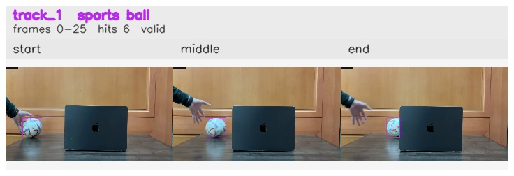

# Exit_frame_while_occluded / track_1

## Summary
- class: sports ball (32)
- frames: 0-25 (26 frame span)
- hits: 6
- valid track: yes
- had recovery: no
- relinked from: none
- fragment track ids: 1
- avg visual similarity: 0.9676
- total misses: 7
- max miss streak: 7

## Label Mix
- sports ball (32): 6 detections, confidence sum 5.146

## Relink Edges
- none

## Event Timeline
- frame 0: created
- frame 5: activated
- frame 25: closed
- frame 30: lost

## Key Frames
- start: frame 0, fragment 1, [image](frames/start_f0000.jpg)
- middle: frame 15, fragment 1, [image](frames/middle_f0015.jpg)
- end: frame 25, fragment 1, [image](frames/end_f0025.jpg)

[track metadata](track.json)
