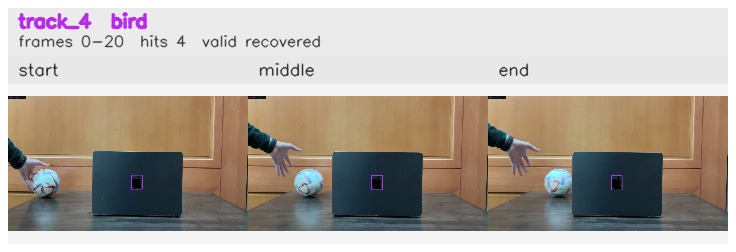

# Exit_frame_while_occluded / track_4

## Summary
- class: bird (14)
- frames: 0-20 (21 frame span)
- hits: 4
- valid track: yes
- had recovery: yes
- relinked from: none
- fragment track ids: 4
- avg visual similarity: 0.9911
- total misses: 8
- max miss streak: 7

## Label Mix
- bird (14): 4 detections, confidence sum 1.584

## Relink Edges
- none

## Event Timeline
- frame 0: created
- frame 5: lost
- frame 10: recovered
- frame 20: closed
- frame 25: lost

## Key Frames
- start: frame 0, fragment 4, [image](frames/start_f0000.jpg)
- middle: frame 15, fragment 4, [image](frames/middle_f0015.jpg)
- end: frame 20, fragment 4, [image](frames/end_f0020.jpg)

[track metadata](track.json)
