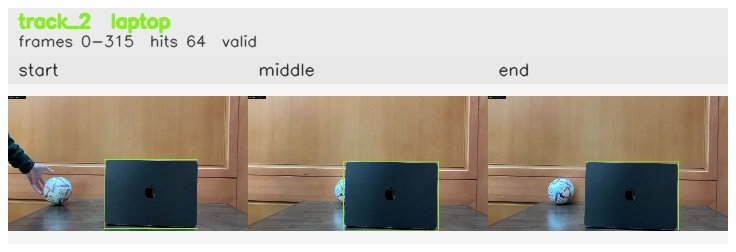

# Left_bounce_back / track_2

## Summary
- class: laptop (63)
- frames: 0-315 (316 frame span)
- hits: 64
- valid track: yes
- had recovery: no
- relinked from: none
- fragment track ids: 2
- avg visual similarity: 0.9982
- total misses: 0
- max miss streak: 0

## Label Mix
- laptop (63): 64 detections, confidence sum 59.782

## Relink Edges
- none

## Event Timeline
- frame 0: created
- frame 5: activated
- frame 315: closed

## Key Frames
- start: frame 0, fragment 2, [image](frames/start_f0000.jpg)
- middle: frame 160, fragment 2, [image](frames/middle_f0160.jpg)
- end: frame 315, fragment 2, [image](frames/end_f0315.jpg)

[track metadata](track.json)
