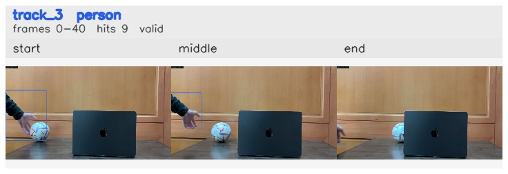

# Left_bounce_back / track_3

## Summary
- class: person (0)
- frames: 0-40 (41 frame span)
- hits: 9
- valid track: yes
- had recovery: no
- relinked from: none
- fragment track ids: 3
- avg visual similarity: 0.9367
- total misses: 7
- max miss streak: 7

## Label Mix
- person (0): 9 detections, confidence sum 5.882

## Relink Edges
- none

## Event Timeline
- frame 0: created
- frame 5: activated
- frame 40: closed
- frame 45: lost

## Key Frames
- start: frame 0, fragment 3, [image](frames/start_f0000.jpg)
- middle: frame 20, fragment 3, [image](frames/middle_f0020.jpg)
- end: frame 40, fragment 3, [image](frames/end_f0040.jpg)

[track metadata](track.json)
