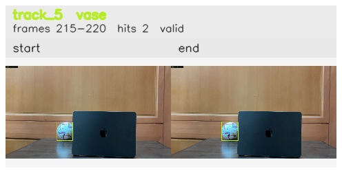

# Left_bounce_back / track_5

## Summary
- class: vase (75)
- frames: 215-220 (6 frame span)
- hits: 2
- valid track: yes
- had recovery: no
- relinked from: none
- fragment track ids: 5
- avg visual similarity: 0.9803
- total misses: 7
- max miss streak: 7

## Label Mix
- vase (75): 2 detections, confidence sum 0.567

## Relink Edges
- none

## Event Timeline
- frame 215: created
- frame 220: activated
- frame 220: closed
- frame 225: lost

## Key Frames
- start: frame 215, fragment 5, [image](frames/start_f0215.jpg)
- end: frame 220, fragment 5, [image](frames/end_f0220.jpg)

[track metadata](track.json)
