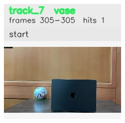

# Left_bounce_back / track_7

## Summary
- class: vase (75)
- frames: 305-305 (1 frame span)
- hits: 1
- valid track: no
- had recovery: no
- relinked from: none
- fragment track ids: 7
- avg visual similarity: n/a
- total misses: 2
- max miss streak: 2

## Label Mix
- vase (75): 1 detections, confidence sum 0.275

## Relink Edges
- none

## Event Timeline
- frame 305: closed
- frame 305: created
- frame 310: lost

## Key Frames
- start: frame 305, fragment 7, [image](frames/start_f0305.jpg)

[track metadata](track.json)
