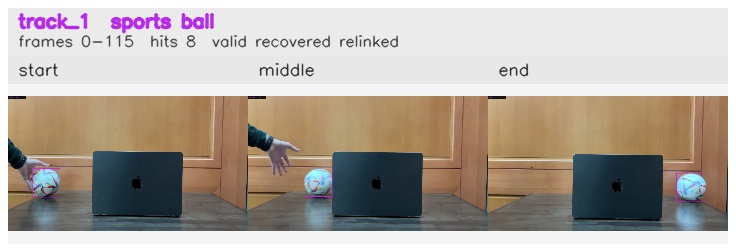

# Left_to_right / track_1

## Summary
- class: sports ball (32)
- frames: 0-115 (116 frame span)
- hits: 8
- valid track: yes
- had recovery: yes
- relinked from: 7
- fragment track ids: 1, 7
- avg visual similarity: 0.9491
- total misses: 9
- max miss streak: 7

## Label Mix
- sports ball (32): 6 detections, confidence sum 5.011
- vase (75): 2 detections, confidence sum 0.643

## Relink Edges
- 1 -> 7 via dino (score 0.7797)

## Event Timeline
- frame 0: created
- frame 5: activated
- frame 25: closed
- frame 30: lost
- frame 105: created
- frame 110: lost
- frame 115: closed
- frame 115: recovered
- frame 120: lost

## Key Frames
- start: frame 0, fragment 1, [image](frames/start_f0000.jpg)
- middle: frame 20, fragment 1, [image](frames/middle_f0020.jpg)
- end: frame 115, fragment 7, [image](frames/end_f0115.jpg)

[track metadata](track.json)
