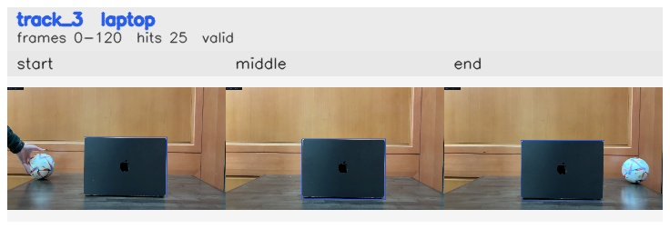

# Left_to_right / track_3

## Summary
- class: laptop (63)
- frames: 0-120 (121 frame span)
- hits: 25
- valid track: yes
- had recovery: no
- relinked from: none
- fragment track ids: 3
- avg visual similarity: 0.9964
- total misses: 0
- max miss streak: 0

## Label Mix
- laptop (63): 25 detections, confidence sum 20.464

## Relink Edges
- none

## Event Timeline
- frame 0: created
- frame 5: activated
- frame 120: closed

## Key Frames
- start: frame 0, fragment 3, [image](frames/start_f0000.jpg)
- middle: frame 60, fragment 3, [image](frames/middle_f0060.jpg)
- end: frame 120, fragment 3, [image](frames/end_f0120.jpg)

[track metadata](track.json)
