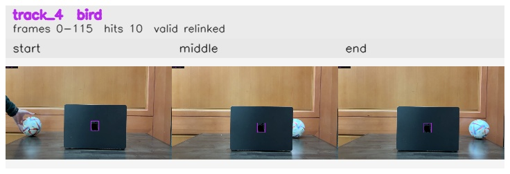

# Left_to_right / track_4

## Summary
- class: bird (14)
- frames: 0-115 (116 frame span)
- hits: 10
- valid track: yes
- had recovery: no
- relinked from: 6
- fragment track ids: 4, 6
- avg visual similarity: 0.9933
- total misses: 8
- max miss streak: 7

## Label Mix
- bird (14): 10 detections, confidence sum 3.264

## Relink Edges
- 4 -> 6 via dino (score 0.9749)

## Event Timeline
- frame 0: created
- frame 5: activated
- frame 15: closed
- frame 20: lost
- frame 90: created
- frame 95: activated
- frame 115: closed
- frame 120: lost

## Key Frames
- start: frame 0, fragment 4, [image](frames/start_f0000.jpg)
- middle: frame 95, fragment 6, [image](frames/middle_f0095.jpg)
- end: frame 115, fragment 6, [image](frames/end_f0115.jpg)

[track metadata](track.json)
