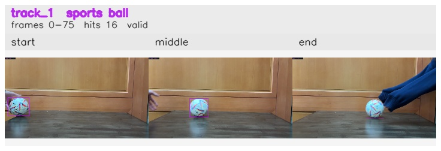

# No_occlusion_ball_removed / track_1

## Summary
- class: sports ball (32)
- frames: 0-75 (76 frame span)
- hits: 16
- valid track: yes
- had recovery: no
- relinked from: none
- fragment track ids: 1
- avg visual similarity: 0.8579
- total misses: 7
- max miss streak: 7

## Label Mix
- sports ball (32): 16 detections, confidence sum 11.979

## Relink Edges
- none

## Event Timeline
- frame 0: created
- frame 5: activated
- frame 75: closed
- frame 80: lost

## Key Frames
- start: frame 0, fragment 1, [image](frames/start_f0000.jpg)
- middle: frame 40, fragment 1, [image](frames/middle_f0040.jpg)
- end: frame 75, fragment 1, [image](frames/end_f0075.jpg)

[track metadata](track.json)
