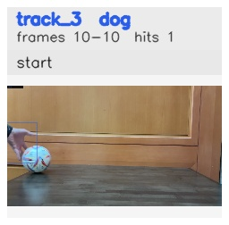

# No_occlusion_ball_removed / track_3

## Summary
- class: dog (16)
- frames: 10-10 (1 frame span)
- hits: 1
- valid track: no
- had recovery: no
- relinked from: none
- fragment track ids: 3
- avg visual similarity: n/a
- total misses: 7
- max miss streak: 7

## Label Mix
- dog (16): 1 detections, confidence sum 0.608

## Relink Edges
- none

## Event Timeline
- frame 10: closed
- frame 10: created
- frame 15: lost

## Key Frames
- start: frame 10, fragment 3, [image](frames/start_f0010.jpg)

[track metadata](track.json)
