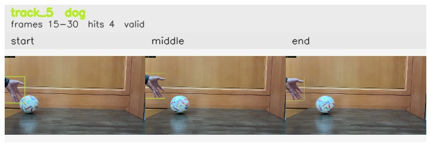

# No_occlusion_ball_removed / track_5

## Summary
- class: dog (16)
- frames: 15-30 (16 frame span)
- hits: 4
- valid track: yes
- had recovery: no
- relinked from: none
- fragment track ids: 5
- avg visual similarity: 0.8803
- total misses: 7
- max miss streak: 7

## Label Mix
- dog (16): 4 detections, confidence sum 2.797

## Relink Edges
- none

## Event Timeline
- frame 15: created
- frame 20: activated
- frame 30: closed
- frame 35: lost

## Key Frames
- start: frame 15, fragment 5, [image](frames/start_f0015.jpg)
- middle: frame 25, fragment 5, [image](frames/middle_f0025.jpg)
- end: frame 30, fragment 5, [image](frames/end_f0030.jpg)

[track metadata](track.json)
