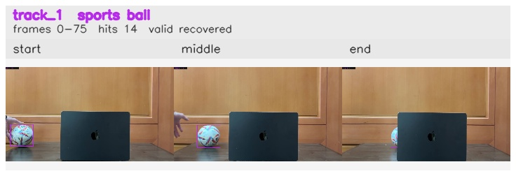

# Occlusion_ball_removed / track_1

## Summary
- class: sports ball (32)
- frames: 0-75 (76 frame span)
- hits: 14
- valid track: yes
- had recovery: yes
- relinked from: none
- fragment track ids: 1
- avg visual similarity: 0.9601
- total misses: 9
- max miss streak: 7

## Label Mix
- sports ball (32): 13 detections, confidence sum 8.794
- vase (75): 1 detections, confidence sum 0.315

## Relink Edges
- none

## Event Timeline
- frame 0: created
- frame 5: activated
- frame 55: lost
- frame 60: recovered
- frame 70: lost
- frame 75: closed
- frame 75: recovered
- frame 80: lost

## Key Frames
- start: frame 0, fragment 1, [image](frames/start_f0000.jpg)
- middle: frame 35, fragment 1, [image](frames/middle_f0035.jpg)
- end: frame 75, fragment 1, [image](frames/end_f0075.jpg)

[track metadata](track.json)
