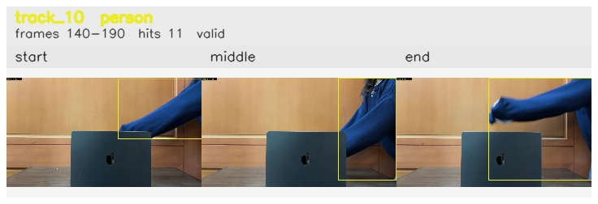

# Occlusion_ball_removed / track_10

## Summary
- class: person (0)
- frames: 140-190 (51 frame span)
- hits: 11
- valid track: yes
- had recovery: no
- relinked from: none
- fragment track ids: 10
- avg visual similarity: 0.9443
- total misses: 7
- max miss streak: 7

## Label Mix
- person (0): 11 detections, confidence sum 6.975

## Relink Edges
- none

## Event Timeline
- frame 140: created
- frame 145: activated
- frame 190: closed
- frame 195: lost

## Key Frames
- start: frame 140, fragment 10, [image](frames/start_f0140.jpg)
- middle: frame 165, fragment 10, [image](frames/middle_f0165.jpg)
- end: frame 190, fragment 10, [image](frames/end_f0190.jpg)

[track metadata](track.json)
