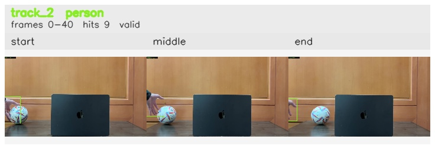

# Occlusion_ball_removed / track_2

## Summary
- class: person (0)
- frames: 0-40 (41 frame span)
- hits: 9
- valid track: yes
- had recovery: no
- relinked from: none
- fragment track ids: 2
- avg visual similarity: 0.9332
- total misses: 7
- max miss streak: 7

## Label Mix
- person (0): 8 detections, confidence sum 4.207
- dog (16): 1 detections, confidence sum 0.486

## Relink Edges
- none

## Event Timeline
- frame 0: created
- frame 5: activated
- frame 40: closed
- frame 45: lost

## Key Frames
- start: frame 0, fragment 2, [image](frames/start_f0000.jpg)
- middle: frame 20, fragment 2, [image](frames/middle_f0020.jpg)
- end: frame 40, fragment 2, [image](frames/end_f0040.jpg)

[track metadata](track.json)
