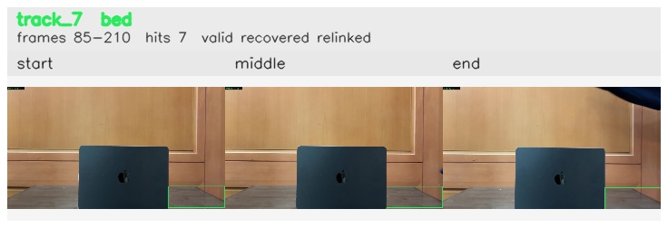

# Occlusion_ball_removed / track_7

## Summary
- class: bed (59)
- frames: 85-210 (126 frame span)
- hits: 7
- valid track: yes
- had recovery: yes
- relinked from: 12
- fragment track ids: 7, 12
- avg visual similarity: 0.9970
- total misses: 13
- max miss streak: 7

## Label Mix
- bed (59): 7 detections, confidence sum 3.085

## Relink Edges
- 7 -> 12 via dino (score 0.9386)

## Event Timeline
- frame 85: created
- frame 90: lost
- frame 95: recovered
- frame 110: closed
- frame 115: lost
- frame 205: created
- frame 210: activated
- frame 210: closed
- frame 215: lost

## Key Frames
- start: frame 85, fragment 7, [image](frames/start_f0085.jpg)
- middle: frame 105, fragment 7, [image](frames/middle_f0105.jpg)
- end: frame 210, fragment 12, [image](frames/end_f0210.jpg)

[track metadata](track.json)
