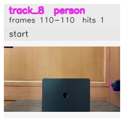

# Occlusion_ball_removed / track_8

## Summary
- class: person (0)
- frames: 110-110 (1 frame span)
- hits: 1
- valid track: no
- had recovery: no
- relinked from: none
- fragment track ids: 8
- avg visual similarity: n/a
- total misses: 7
- max miss streak: 7

## Label Mix
- person (0): 1 detections, confidence sum 0.255

## Relink Edges
- none

## Event Timeline
- frame 110: closed
- frame 110: created
- frame 115: lost

## Key Frames
- start: frame 110, fragment 8, [image](frames/start_f0110.jpg)

[track metadata](track.json)
