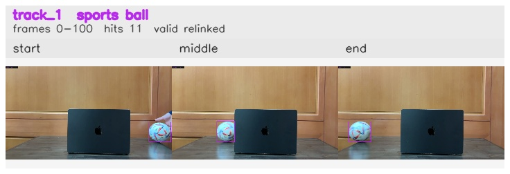

# Right_to_left / track_1

## Summary
- class: sports ball (32)
- frames: 0-100 (101 frame span)
- hits: 11
- valid track: yes
- had recovery: no
- relinked from: 4
- fragment track ids: 1, 4
- avg visual similarity: 0.9497
- total misses: 7
- max miss streak: 7

## Label Mix
- sports ball (32): 11 detections, confidence sum 7.757

## Relink Edges
- 1 -> 4 via dino (score 0.9109)

## Event Timeline
- frame 0: created
- frame 5: activated
- frame 15: closed
- frame 20: lost
- frame 70: created
- frame 75: activated
- frame 100: closed

## Key Frames
- start: frame 0, fragment 1, [image](frames/start_f0000.jpg)
- middle: frame 75, fragment 4, [image](frames/middle_f0075.jpg)
- end: frame 100, fragment 4, [image](frames/end_f0100.jpg)

[track metadata](track.json)
