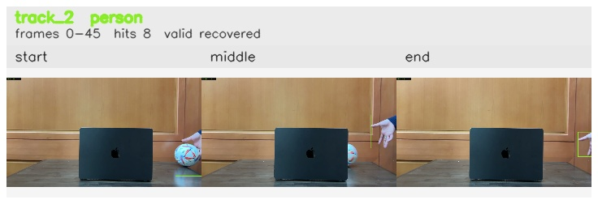

# Right_to_left / track_2

## Summary
- class: person (0)
- frames: 0-45 (46 frame span)
- hits: 8
- valid track: yes
- had recovery: yes
- relinked from: none
- fragment track ids: 2
- avg visual similarity: 0.8855
- total misses: 9
- max miss streak: 7

## Label Mix
- person (0): 7 detections, confidence sum 3.887
- cat (15): 1 detections, confidence sum 0.290

## Relink Edges
- none

## Event Timeline
- frame 0: created
- frame 5: lost
- frame 10: recovered
- frame 40: lost
- frame 45: closed
- frame 45: recovered
- frame 50: lost

## Key Frames
- start: frame 0, fragment 2, [image](frames/start_f0000.jpg)
- middle: frame 25, fragment 2, [image](frames/middle_f0025.jpg)
- end: frame 45, fragment 2, [image](frames/end_f0045.jpg)

[track metadata](track.json)
