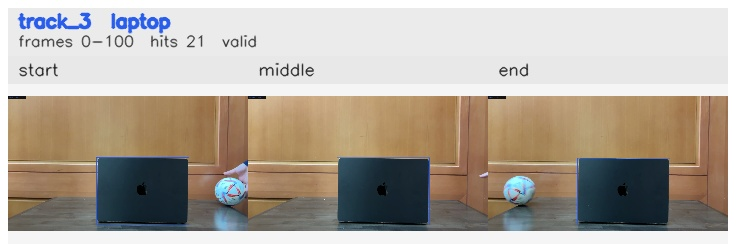

# Right_to_left / track_3

## Summary
- class: laptop (63)
- frames: 0-100 (101 frame span)
- hits: 21
- valid track: yes
- had recovery: no
- relinked from: none
- fragment track ids: 3
- avg visual similarity: 0.9957
- total misses: 0
- max miss streak: 0

## Label Mix
- laptop (63): 21 detections, confidence sum 16.262

## Relink Edges
- none

## Event Timeline
- frame 0: created
- frame 5: activated
- frame 100: closed

## Key Frames
- start: frame 0, fragment 3, [image](frames/start_f0000.jpg)
- middle: frame 50, fragment 3, [image](frames/middle_f0050.jpg)
- end: frame 100, fragment 3, [image](frames/end_f0100.jpg)

[track metadata](track.json)
