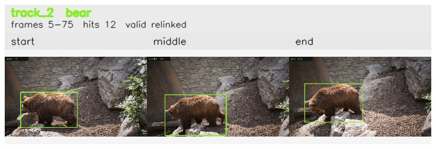

# davis__bear_occlusion__bear / track_2

## Summary
- class: bear (21)
- frames: 5-75 (71 frame span)
- hits: 12
- valid track: yes
- had recovery: no
- relinked from: 5, 8
- fragment track ids: 2, 5, 8
- avg visual similarity: 0.8154
- total misses: 15
- max miss streak: 7

## Label Mix
- bear (21): 12 detections, confidence sum 11.419

## Relink Edges
- 2 -> 5 via dino (score 0.9597)
- 5 -> 8 via dino (score 0.9735)

## Event Timeline
- frame 5: created
- frame 10: activated
- frame 25: closed
- frame 30: lost
- frame 35: created
- frame 40: activated
- frame 45: closed
- frame 50: lost
- frame 60: created
- frame 65: activated
- frame 75: closed
- frame 80: lost

## Key Frames
- start: frame 5, fragment 2, [image](frames/start_f0005.jpg)
- middle: frame 40, fragment 5, [image](frames/middle_f0040.jpg)
- end: frame 75, fragment 8, [image](frames/end_f0075.jpg)

[track metadata](track.json)
