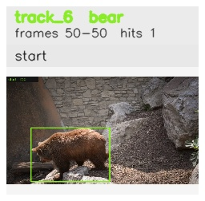

# davis__bear_occlusion__bear / track_6

## Summary
- class: bear (21)
- frames: 50-50 (1 frame span)
- hits: 1
- valid track: no
- had recovery: no
- relinked from: none
- fragment track ids: 6
- avg visual similarity: n/a
- total misses: 6
- max miss streak: 6

## Label Mix
- bear (21): 1 detections, confidence sum 0.954

## Relink Edges
- none

## Event Timeline
- frame 50: closed
- frame 50: created
- frame 55: lost

## Key Frames
- start: frame 50, fragment 6, [image](frames/start_f0050.jpg)

[track metadata](track.json)
