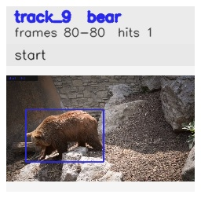

# davis__bear_occlusion__bear / track_9

## Summary
- class: bear (21)
- frames: 80-80 (1 frame span)
- hits: 1
- valid track: no
- had recovery: no
- relinked from: none
- fragment track ids: 9
- avg visual similarity: n/a
- total misses: 0
- max miss streak: 0

## Label Mix
- bear (21): 1 detections, confidence sum 0.965

## Relink Edges
- none

## Event Timeline
- frame 80: closed
- frame 80: created

## Key Frames
- start: frame 80, fragment 9, [image](frames/start_f0080.jpg)

[track metadata](track.json)
