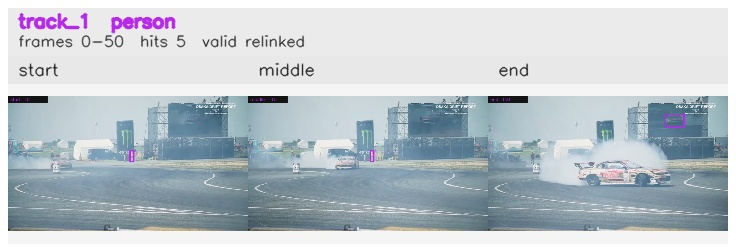

# davis__car_speed__drift_chicane / track_1

## Summary
- class: person (0)
- frames: 0-50 (51 frame span)
- hits: 5
- valid track: yes
- had recovery: no
- relinked from: 12
- fragment track ids: 1, 12
- avg visual similarity: 0.8886
- total misses: 7
- max miss streak: 7

## Label Mix
- person (0): 3 detections, confidence sum 1.355
- car (2): 2 detections, confidence sum 1.137

## Relink Edges
- 1 -> 12 via spatial (score 0.4197)

## Event Timeline
- frame 0: created
- frame 5: activated
- frame 10: closed
- frame 15: lost
- frame 45: created
- frame 50: activated
- frame 50: closed

## Key Frames
- start: frame 0, fragment 1, [image](frames/start_f0000.jpg)
- middle: frame 10, fragment 1, [image](frames/middle_f0010.jpg)
- end: frame 50, fragment 12, [image](frames/end_f0050.jpg)

[track metadata](track.json)
