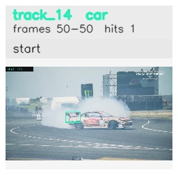

# davis__car_speed__drift_chicane / track_14

## Summary
- class: car (2)
- frames: 50-50 (1 frame span)
- hits: 1
- valid track: no
- had recovery: no
- relinked from: none
- fragment track ids: 14
- avg visual similarity: n/a
- total misses: 0
- max miss streak: 0

## Label Mix
- car (2): 1 detections, confidence sum 0.338

## Relink Edges
- none

## Event Timeline
- frame 50: closed
- frame 50: created

## Key Frames
- start: frame 50, fragment 14, [image](frames/start_f0050.jpg)

[track metadata](track.json)
