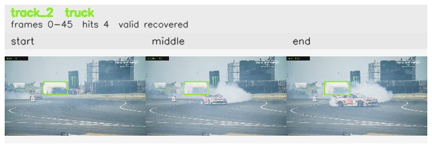

# davis__car_speed__drift_chicane / track_2

## Summary
- class: truck (7)
- frames: 0-45 (46 frame span)
- hits: 4
- valid track: yes
- had recovery: yes
- relinked from: none
- fragment track ids: 2
- avg visual similarity: 0.8195
- total misses: 7
- max miss streak: 6

## Label Mix
- truck (7): 3 detections, confidence sum 1.156
- airplane (4): 1 detections, confidence sum 0.322

## Relink Edges
- none

## Event Timeline
- frame 0: created
- frame 5: activated
- frame 10: lost
- frame 40: recovered
- frame 45: closed
- frame 50: lost

## Key Frames
- start: frame 0, fragment 2, [image](frames/start_f0000.jpg)
- middle: frame 40, fragment 2, [image](frames/middle_f0040.jpg)
- end: frame 45, fragment 2, [image](frames/end_f0045.jpg)

[track metadata](track.json)
