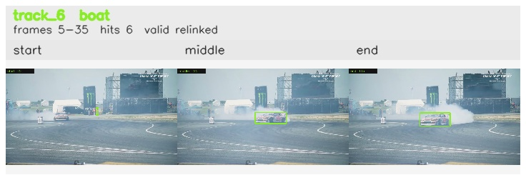

# davis__car_speed__drift_chicane / track_6

## Summary
- class: boat (8)
- frames: 5-35 (31 frame span)
- hits: 6
- valid track: yes
- had recovery: no
- relinked from: 9
- fragment track ids: 6, 9
- avg visual similarity: 0.8713
- total misses: 10
- max miss streak: 7

## Label Mix
- boat (8): 3 detections, confidence sum 1.531
- car (2): 1 detections, confidence sum 0.670
- person (0): 2 detections, confidence sum 0.618

## Relink Edges
- 6 -> 9 via spatial (score 0.6912)

## Event Timeline
- frame 5: created
- frame 10: activated
- frame 10: closed
- frame 15: lost
- frame 20: created
- frame 25: activated
- frame 35: closed
- frame 40: lost

## Key Frames
- start: frame 5, fragment 6, [image](frames/start_f0005.jpg)
- middle: frame 25, fragment 9, [image](frames/middle_f0025.jpg)
- end: frame 35, fragment 9, [image](frames/end_f0035.jpg)

[track metadata](track.json)
