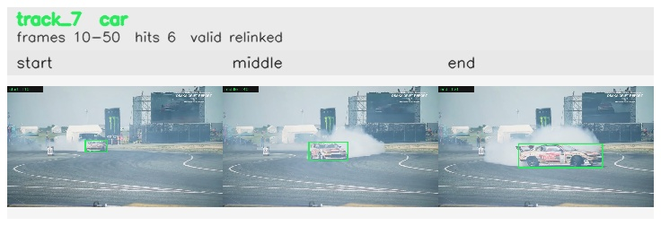

# davis__car_speed__drift_chicane / track_7

## Summary
- class: car (2)
- frames: 10-50 (41 frame span)
- hits: 6
- valid track: yes
- had recovery: no
- relinked from: 10
- fragment track ids: 7, 10
- avg visual similarity: 0.8241
- total misses: 7
- max miss streak: 7

## Label Mix
- car (2): 6 detections, confidence sum 4.241

## Relink Edges
- 7 -> 10 via dino (score 0.7825)

## Event Timeline
- frame 10: created
- frame 15: activated
- frame 15: closed
- frame 20: lost
- frame 35: created
- frame 40: activated
- frame 50: closed

## Key Frames
- start: frame 10, fragment 7, [image](frames/start_f0010.jpg)
- middle: frame 40, fragment 10, [image](frames/middle_f0040.jpg)
- end: frame 50, fragment 10, [image](frames/end_f0050.jpg)

[track metadata](track.json)
