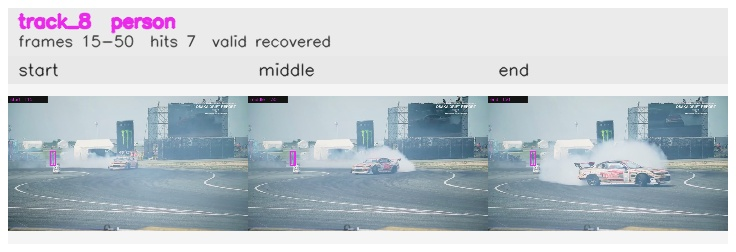

# davis__car_speed__drift_chicane / track_8

## Summary
- class: person (0)
- frames: 15-50 (36 frame span)
- hits: 7
- valid track: yes
- had recovery: yes
- relinked from: none
- fragment track ids: 8
- avg visual similarity: 0.9592
- total misses: 1
- max miss streak: 1

## Label Mix
- person (0): 7 detections, confidence sum 3.368

## Relink Edges
- none

## Event Timeline
- frame 15: created
- frame 20: activated
- frame 40: lost
- frame 45: recovered
- frame 50: closed

## Key Frames
- start: frame 15, fragment 8, [image](frames/start_f0015.jpg)
- middle: frame 30, fragment 8, [image](frames/middle_f0030.jpg)
- end: frame 50, fragment 8, [image](frames/end_f0050.jpg)

[track metadata](track.json)
