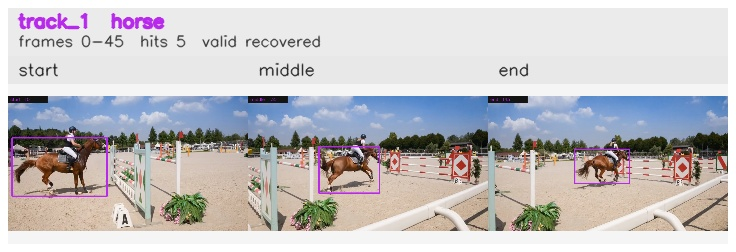

# davis__horse_person_occlusion__horsejump_high / track_1

## Summary
- class: horse (17)
- frames: 0-45 (46 frame span)
- hits: 5
- valid track: yes
- had recovery: yes
- relinked from: none
- fragment track ids: 1
- avg visual similarity: 0.8258
- total misses: 5
- max miss streak: 5

## Label Mix
- horse (17): 5 detections, confidence sum 4.494

## Relink Edges
- none

## Event Timeline
- frame 0: created
- frame 5: activated
- frame 10: lost
- frame 35: recovered
- frame 45: closed

## Key Frames
- start: frame 0, fragment 1, [image](frames/start_f0000.jpg)
- middle: frame 35, fragment 1, [image](frames/middle_f0035.jpg)
- end: frame 45, fragment 1, [image](frames/end_f0045.jpg)

[track metadata](track.json)
