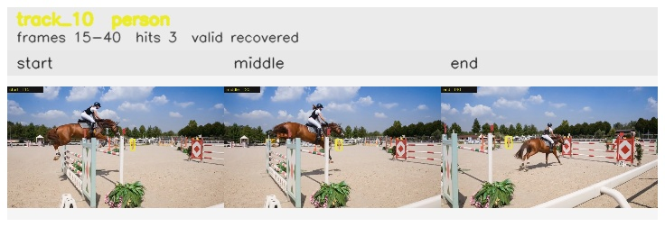

# davis__horse_person_occlusion__horsejump_high / track_10

## Summary
- class: person (0)
- frames: 15-40 (26 frame span)
- hits: 3
- valid track: yes
- had recovery: yes
- relinked from: none
- fragment track ids: 10
- avg visual similarity: 0.8453
- total misses: 4
- max miss streak: 3

## Label Mix
- person (0): 2 detections, confidence sum 0.673
- horse (17): 1 detections, confidence sum 0.254

## Relink Edges
- none

## Event Timeline
- frame 15: created
- frame 20: activated
- frame 25: lost
- frame 40: closed
- frame 40: recovered
- frame 45: lost

## Key Frames
- start: frame 15, fragment 10, [image](frames/start_f0015.jpg)
- middle: frame 20, fragment 10, [image](frames/middle_f0020.jpg)
- end: frame 40, fragment 10, [image](frames/end_f0040.jpg)

[track metadata](track.json)
