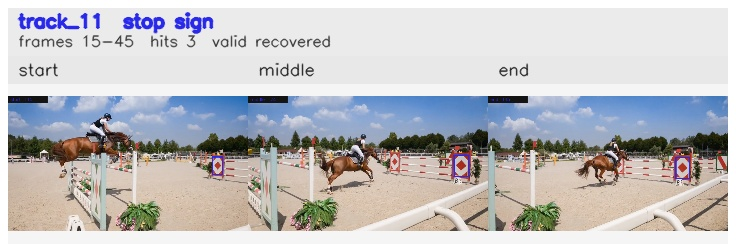

# davis__horse_person_occlusion__horsejump_high / track_11

## Summary
- class: stop sign (11)
- frames: 15-45 (31 frame span)
- hits: 3
- valid track: yes
- had recovery: yes
- relinked from: none
- fragment track ids: 11
- avg visual similarity: 0.9392
- total misses: 4
- max miss streak: 3

## Label Mix
- stop sign (11): 3 detections, confidence sum 1.079

## Relink Edges
- none

## Event Timeline
- frame 15: created
- frame 20: lost
- frame 35: recovered
- frame 40: lost
- frame 45: closed
- frame 45: recovered

## Key Frames
- start: frame 15, fragment 11, [image](frames/start_f0015.jpg)
- middle: frame 35, fragment 11, [image](frames/middle_f0035.jpg)
- end: frame 45, fragment 11, [image](frames/end_f0045.jpg)

[track metadata](track.json)
