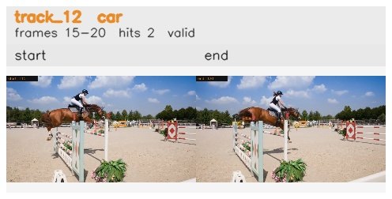

# davis__horse_person_occlusion__horsejump_high / track_12

## Summary
- class: car (2)
- frames: 15-20 (6 frame span)
- hits: 2
- valid track: yes
- had recovery: no
- relinked from: none
- fragment track ids: 12
- avg visual similarity: 0.9665
- total misses: 5
- max miss streak: 5

## Label Mix
- car (2): 2 detections, confidence sum 0.650

## Relink Edges
- none

## Event Timeline
- frame 15: created
- frame 20: activated
- frame 20: closed
- frame 25: lost

## Key Frames
- start: frame 15, fragment 12, [image](frames/start_f0015.jpg)
- end: frame 20, fragment 12, [image](frames/end_f0020.jpg)

[track metadata](track.json)
