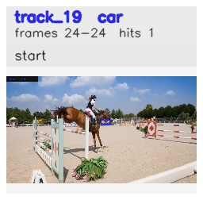

# davis__horse_person_occlusion__horsejump_high / track_19

## Summary
- class: car (2)
- frames: 24-24 (1 frame span)
- hits: 1
- valid track: no
- had recovery: no
- relinked from: none
- fragment track ids: 19
- avg visual similarity: n/a
- total misses: 7
- max miss streak: 7

## Label Mix
- car (2): 1 detections, confidence sum 0.266

## Relink Edges
- none

## Event Timeline
- frame 24: closed
- frame 24: created
- frame 25: lost

## Key Frames
- start: frame 24, fragment 19, [image](frames/start_f0024.jpg)

[track metadata](track.json)
