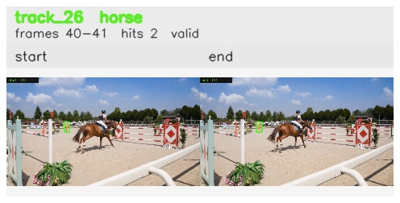

# davis__horse_person_occlusion__horsejump_high / track_26

## Summary
- class: horse (17)
- frames: 40-41 (2 frame span)
- hits: 2
- valid track: yes
- had recovery: no
- relinked from: none
- fragment track ids: 26
- avg visual similarity: 0.8928
- total misses: 7
- max miss streak: 7

## Label Mix
- horse (17): 2 detections, confidence sum 0.520

## Relink Edges
- none

## Event Timeline
- frame 40: created
- frame 41: activated
- frame 41: closed
- frame 42: lost

## Key Frames
- start: frame 40, fragment 26, [image](frames/start_f0040.jpg)
- end: frame 41, fragment 26, [image](frames/end_f0041.jpg)

[track metadata](track.json)
