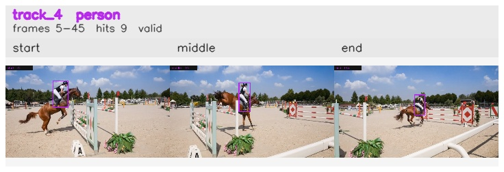

# davis__horse_person_occlusion__horsejump_high / track_4

## Summary
- class: person (0)
- frames: 5-45 (41 frame span)
- hits: 9
- valid track: yes
- had recovery: no
- relinked from: none
- fragment track ids: 4
- avg visual similarity: 0.8271
- total misses: 0
- max miss streak: 0

## Label Mix
- person (0): 9 detections, confidence sum 6.740

## Relink Edges
- none

## Event Timeline
- frame 5: created
- frame 10: activated
- frame 45: closed

## Key Frames
- start: frame 5, fragment 4, [image](frames/start_f0005.jpg)
- middle: frame 25, fragment 4, [image](frames/middle_f0025.jpg)
- end: frame 45, fragment 4, [image](frames/end_f0045.jpg)

[track metadata](track.json)
