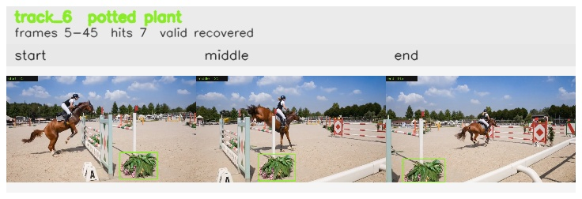

# davis__horse_person_occlusion__horsejump_high / track_6

## Summary
- class: potted plant (58)
- frames: 5-45 (41 frame span)
- hits: 7
- valid track: yes
- had recovery: yes
- relinked from: none
- fragment track ids: 6
- avg visual similarity: 0.9624
- total misses: 2
- max miss streak: 1

## Label Mix
- potted plant (58): 7 detections, confidence sum 2.870

## Relink Edges
- none

## Event Timeline
- frame 5: created
- frame 10: lost
- frame 15: recovered
- frame 30: lost
- frame 35: recovered
- frame 45: closed

## Key Frames
- start: frame 5, fragment 6, [image](frames/start_f0005.jpg)
- middle: frame 25, fragment 6, [image](frames/middle_f0025.jpg)
- end: frame 45, fragment 6, [image](frames/end_f0045.jpg)

[track metadata](track.json)
