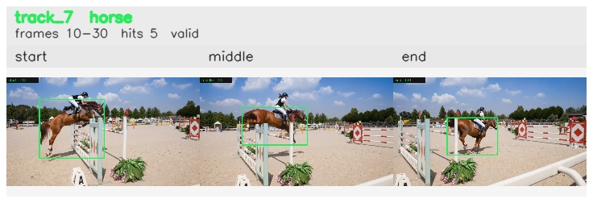

# davis__horse_person_occlusion__horsejump_high / track_7

## Summary
- class: horse (17)
- frames: 10-30 (21 frame span)
- hits: 5
- valid track: yes
- had recovery: no
- relinked from: none
- fragment track ids: 7
- avg visual similarity: 0.7832
- total misses: 3
- max miss streak: 3

## Label Mix
- horse (17): 5 detections, confidence sum 3.876

## Relink Edges
- none

## Event Timeline
- frame 10: created
- frame 15: activated
- frame 30: closed
- frame 35: lost

## Key Frames
- start: frame 10, fragment 7, [image](frames/start_f0010.jpg)
- middle: frame 20, fragment 7, [image](frames/middle_f0020.jpg)
- end: frame 30, fragment 7, [image](frames/end_f0030.jpg)

[track metadata](track.json)
