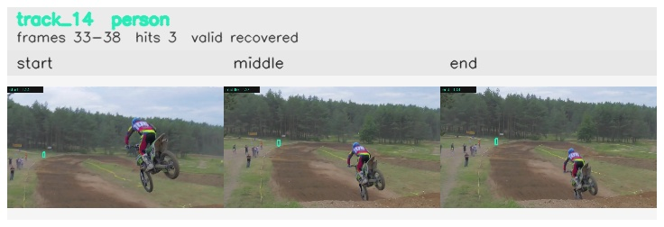

# davis__motorcycle_jump__motocross_jump / track_14

## Summary
- class: person (0)
- frames: 33-38 (6 frame span)
- hits: 3
- valid track: yes
- had recovery: yes
- relinked from: none
- fragment track ids: 14
- avg visual similarity: 0.8065
- total misses: 4
- max miss streak: 3

## Label Mix
- person (0): 3 detections, confidence sum 0.831

## Relink Edges
- none

## Event Timeline
- frame 33: created
- frame 34: lost
- frame 37: recovered
- frame 38: closed
- frame 39: lost

## Key Frames
- start: frame 33, fragment 14, [image](frames/start_f0033.jpg)
- middle: frame 37, fragment 14, [image](frames/middle_f0037.jpg)
- end: frame 38, fragment 14, [image](frames/end_f0038.jpg)

[track metadata](track.json)
