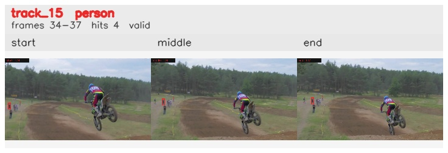

# davis__motorcycle_jump__motocross_jump / track_15

## Summary
- class: person (0)
- frames: 34-37 (4 frame span)
- hits: 4
- valid track: yes
- had recovery: no
- relinked from: none
- fragment track ids: 15
- avg visual similarity: 0.7372
- total misses: 2
- max miss streak: 2

## Label Mix
- person (0): 4 detections, confidence sum 1.685

## Relink Edges
- none

## Event Timeline
- frame 34: created
- frame 35: activated
- frame 37: closed
- frame 38: lost

## Key Frames
- start: frame 34, fragment 15, [image](frames/start_f0034.jpg)
- middle: frame 36, fragment 15, [image](frames/middle_f0036.jpg)
- end: frame 37, fragment 15, [image](frames/end_f0037.jpg)

[track metadata](track.json)
