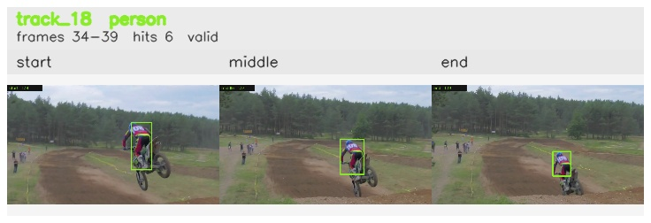

# davis__motorcycle_jump__motocross_jump / track_18

## Summary
- class: person (0)
- frames: 34-39 (6 frame span)
- hits: 6
- valid track: yes
- had recovery: no
- relinked from: none
- fragment track ids: 18
- avg visual similarity: 0.8890
- total misses: 0
- max miss streak: 0

## Label Mix
- person (0): 6 detections, confidence sum 3.600

## Relink Edges
- none

## Event Timeline
- frame 34: created
- frame 35: activated
- frame 39: closed

## Key Frames
- start: frame 34, fragment 18, [image](frames/start_f0034.jpg)
- middle: frame 37, fragment 18, [image](frames/middle_f0037.jpg)
- end: frame 39, fragment 18, [image](frames/end_f0039.jpg)

[track metadata](track.json)
