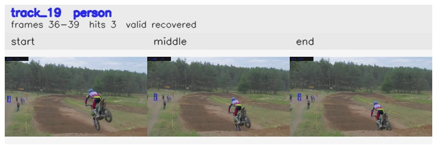

# davis__motorcycle_jump__motocross_jump / track_19

## Summary
- class: person (0)
- frames: 36-39 (4 frame span)
- hits: 3
- valid track: yes
- had recovery: yes
- relinked from: none
- fragment track ids: 19
- avg visual similarity: 0.8793
- total misses: 1
- max miss streak: 1

## Label Mix
- person (0): 3 detections, confidence sum 1.069

## Relink Edges
- none

## Event Timeline
- frame 36: created
- frame 37: lost
- frame 38: recovered
- frame 39: closed

## Key Frames
- start: frame 36, fragment 19, [image](frames/start_f0036.jpg)
- middle: frame 38, fragment 19, [image](frames/middle_f0038.jpg)
- end: frame 39, fragment 19, [image](frames/end_f0039.jpg)

[track metadata](track.json)
