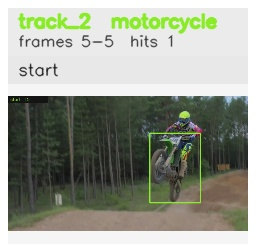

# davis__motorcycle_jump__motocross_jump / track_2

## Summary
- class: motorcycle (3)
- frames: 5-5 (1 frame span)
- hits: 1
- valid track: no
- had recovery: no
- relinked from: none
- fragment track ids: 2
- avg visual similarity: n/a
- total misses: 6
- max miss streak: 6

## Label Mix
- motorcycle (3): 1 detections, confidence sum 0.828

## Relink Edges
- none

## Event Timeline
- frame 5: closed
- frame 5: created
- frame 10: lost

## Key Frames
- start: frame 5, fragment 2, [image](frames/start_f0005.jpg)

[track metadata](track.json)
