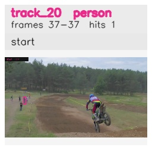

# davis__motorcycle_jump__motocross_jump / track_20

## Summary
- class: person (0)
- frames: 37-37 (1 frame span)
- hits: 1
- valid track: no
- had recovery: no
- relinked from: none
- fragment track ids: 20
- avg visual similarity: n/a
- total misses: 2
- max miss streak: 2

## Label Mix
- person (0): 1 detections, confidence sum 0.425

## Relink Edges
- none

## Event Timeline
- frame 37: closed
- frame 37: created
- frame 38: lost

## Key Frames
- start: frame 37, fragment 20, [image](frames/start_f0037.jpg)

[track metadata](track.json)
