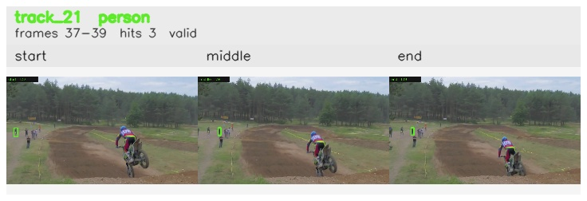

# davis__motorcycle_jump__motocross_jump / track_21

## Summary
- class: person (0)
- frames: 37-39 (3 frame span)
- hits: 3
- valid track: yes
- had recovery: no
- relinked from: none
- fragment track ids: 21
- avg visual similarity: 0.7757
- total misses: 0
- max miss streak: 0

## Label Mix
- person (0): 3 detections, confidence sum 1.212

## Relink Edges
- none

## Event Timeline
- frame 37: created
- frame 38: activated
- frame 39: closed

## Key Frames
- start: frame 37, fragment 21, [image](frames/start_f0037.jpg)
- middle: frame 38, fragment 21, [image](frames/middle_f0038.jpg)
- end: frame 39, fragment 21, [image](frames/end_f0039.jpg)

[track metadata](track.json)
